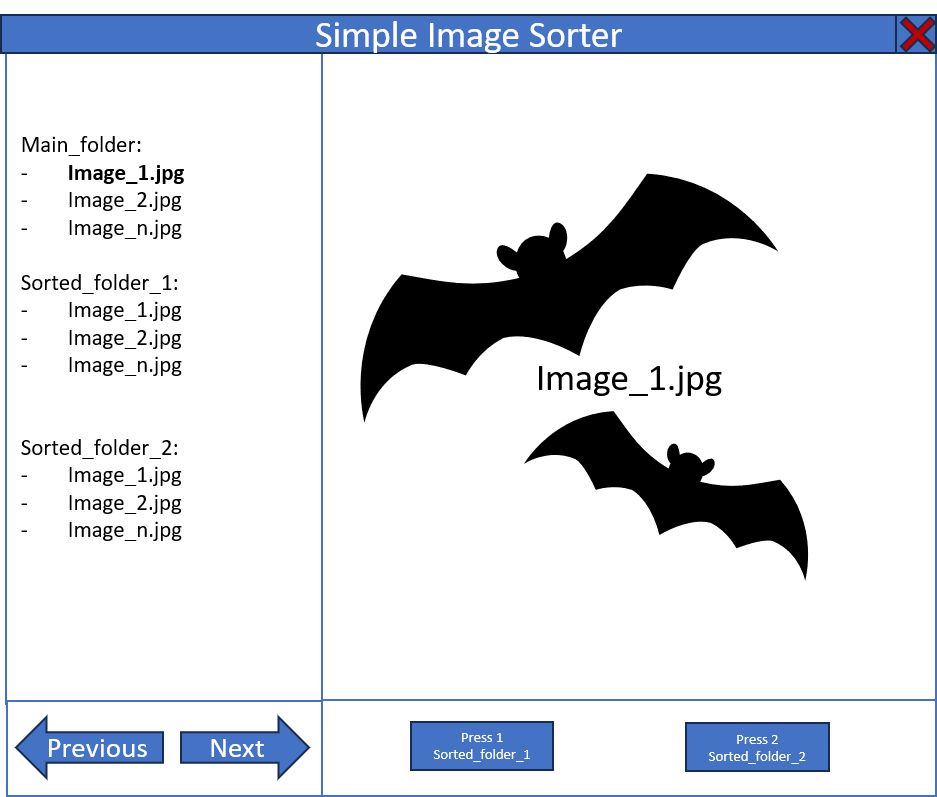

# SimpleImageSorter
Simple application to sort images in a folder using key presses

This application is used to easily view through all images in a folder and to sort them one by one using key presses to new folders.

Application is build in python and compiled to .exe

/Users/wingchung/Documents/repos/SimpleImageSorter/app/
    ├── main.py
    ├── image_viewer.py
    ├── image_loader.py
    ├── thumbnail_creator.py
    └── file_operations.py

# How to use
1. Open the compiled application.
2. Select the folder containing all the folders
3. Define up to 5 new folders linked to numpad key presses.
4. Use arrow keys to go through images.
5. Press numpad key to order image to the defined folder.

## Requirements
Windows Computer that can run .exe
1 GB RAM
16 GB HDD

